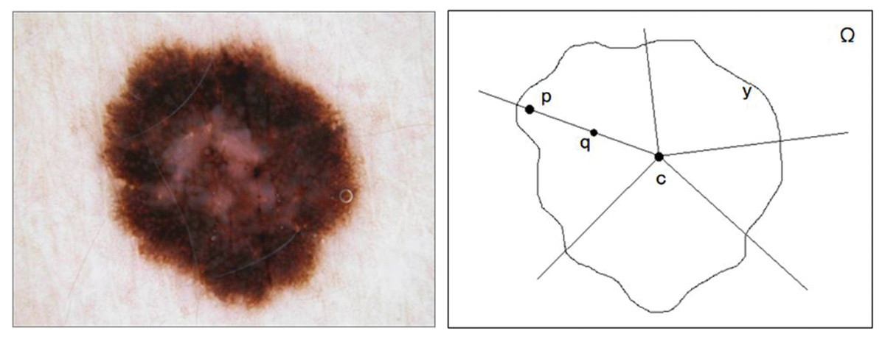

<!--Section 1: Introduce your self-->
## ABOUT ME

Hi! I'm Reinhardt Kiage, a petroleum engineer, machine learning engineer & data scientist, with a passion to build intelligent systems that transform complex data to actionable insights.
With a foundation in engineering and advanced certifications from Stanford and DeepLearningAI, I specialize in building end-to-end data science and machine learning systems.

<!--Mention top/relevant skills here and core and soft skills-->
## CORE SKILLS
* Programming: Python , SQL
* Machine Learning
* MLOPs & Depolyment
* Data Engineering
* Data visualization

<!--Featured Projects-->
## Project Portfolio

**Geospatial Banking Network Optimization.**

Strategic site selection using the Huff Model,Geographically Weighted Regression and p-Median optimization to identify high-potential branch locations in Nairobi, Mombasa, and Kisumu.
* Data Sources: WorldPop,Facebook Mobility,OpenstreetMap,Admin Boundaries
* Database: PostgreSQL, PostGIS
* Tech: Python, Folium, Streamlit
  
Outcome: Optimized site selection to maximize captured demand while minimizing cannibalization risk.

[Dashboard](https://bank-geospatial-network-optimization-zvh4tsayvgyn4rghtgy4bb.streamlit.app)

[Repo](https://github.com/rennykefs/Bank-Geospatial-Network-Optimization)

** Methane Sentinel **

  

An automated geospatial pipeline for monitoring global methane leaks rates an climate impact using Zscore anomaly detection and satellite imagery on selected oil and gas production basins.
* Data Sources: Sentinel-SP satellite(TROPOMI),OGIM infrastructure Data
* Database: Supabase
* Tech: Python, Folium, Streamlit,Github-actions,Google earth engine API, Geospatial Attribution, PDF report Generator

Outcome: Real-time monitoring of energy sector emissions for environmental compliance.

[Dashboard](https://methane-sentinel.streamlit.app)

[Repo](https://github.com/rennykefs/Methane-Sentinel)

** Melanoma Lesion Segmentation & Algorithmic Fairness **

Developing deep learning models for skin lesion detection, specifically optimized for dark skin tones to address biases in global healthcare datasets.
- **Goal:** Enhancing diagnostic accuracy for the Kenyan context through research collaboration with the Kenya Cancer Institute.
- **Tech:** PyTorch, Computer Vision (OpenCV), Deep Lab V3+

** Energy Analytics A/B Experiment **

Evaluated impact of social nudges on peak electricity usage in Kenya using panel based A/B test (n=1000)

* Data Sources: Synthetic generated energy data.csv
* Tech: Python, A/B testing, EDA, Difference-in-Difference analysis

Impact: Estimated causal effects using Difference-in-Differences , resulting in a 5.4% reduction in peak demand and a modeled 0.325 GWh monthly reduction at national scale.

[Repo](https://github.com/rennykefs/Impact-of-Social-Nudges-on-Peak-Electricity-usage-in-Kenya)

** Employee Attrition Prediction **

Developed an end-to-end Data science model to predict staff turnover and support HR retention strategies

* Data Sources: Hr-Employee Attrition file (Kaggle)
* Tech: Python, Advanced EDA, Feature Engineering, Optimized XGBoost, SVM

Performance: Used cross-validation to achieve 92% accuracy and identified key drivers of attrition

[Repo](https://github.com/rennykefs/Larana-Company-Employee-attrition-Prediction-End-to-End-Machine-Learning-Project)

** Petroleum Logistics Operations Anlaytics **

Analyzed truck logistics to evaluate route efficiency and depot performance.

* Data Sources: Logistics operations YoY csv file, Suboptimal routes
* Tech: Python,Google maps API routes distances, Feature engineering, PowerBI

Discovery: Identified critical inefficiencies, including a 39% reliability rate vs. the 95% benchmark and systemic bottlenecks at the Mombasa depot

Solution: Built interactive Power BI dashboards report and engineered KPIs (Route Variance) to project reliability improvements.

[Repo](https://github.com/rennykefs/Sinapii-Petroleum-Logistics-Optimization)

---
## Contact

- **Email:** [kefsreino@gmail.com](mailto:kefsreino@gmail.com)
- **LinkedIn:** [linkedin.com/in/reinhardt-kiage](https://www.linkedin.com/in/reinhardt-kiage)
- **Location:** Nairobi, Kenya 🇰🇪
- **Phone:** [+254 707 804 311](tel:+254707804311)

