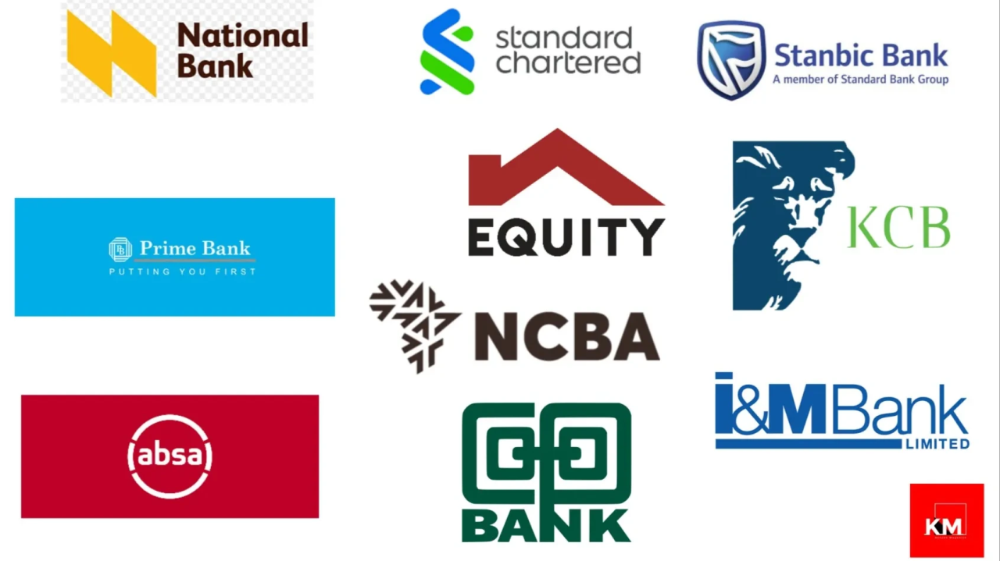
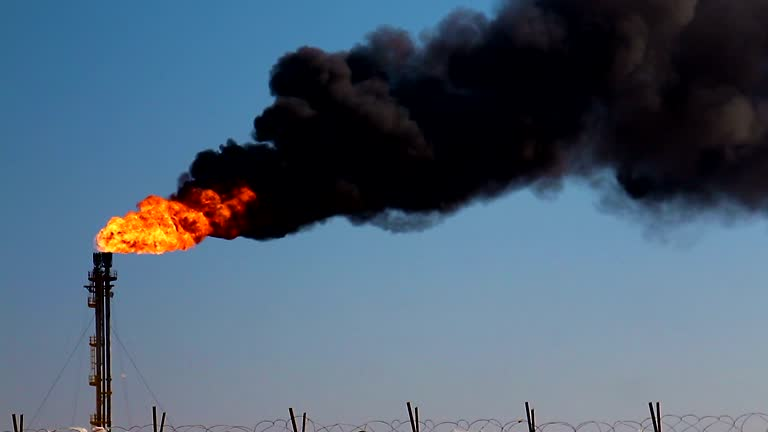

<!--Section 1: Introduce your self-->
## ABOUT ME

Hi! I'm Reinhardt Kiage, a petroleum engineer, machine learning engineer & data scientist, with a passion to build intelligent systems that transform complex data to actionable insights.
With a foundation in engineering and advanced certifications from Stanford and DeepLearningAI, I specialize in building end-to-end data science and machine learning systems.

<!--Mention top/relevant skills here and core and soft skills-->
## CORE SKILLS
* Programming: Python , SQL
* Machine Learning
* MLOPs & Depolyment
* Data Engineering
* Data visualization

<!--Featured Projects-->
**Geospatial Banking Network Optimization.**

Strategic site selection using the Huff Model,Geographically Weighted Regression and p-Median optimization to identify high-potential branch locations in Nairobi, Mombasa, and Kisumu.
* Data Sources: WorldPop,Facebook Mobility,OpenstreetMap,Admin Boundaries
* Database: PostgreSQL, PostGIS
* Tech: Python, Folium, Streamlit
  
Outcome: Optimized site selection to maximize captured demand while minimizing cannibalization risk.

[Dashboard](https://bank-geospatial-network-optimization-zvh4tsayvgyn4rghtgy4bb.streamlit.app)
[Repo](https://github.com/rennykefs/Bank-Geospatial-Network-Optimization)

** Methane Sentinel **

    

An automated geospatial pipeline for monitoring global methane leaks rates an climate impact using Zscore and satellite imagery

